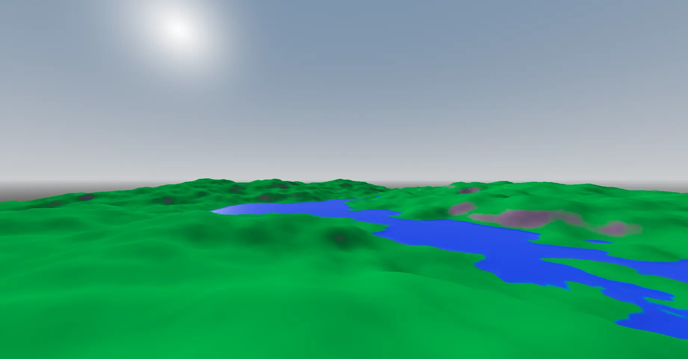
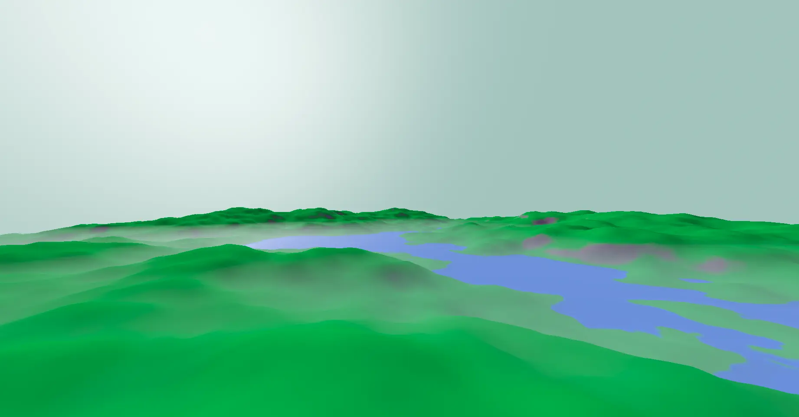
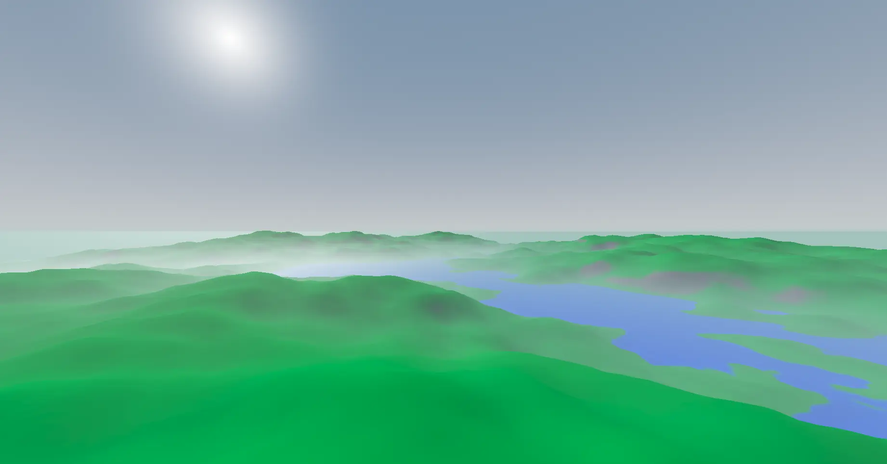
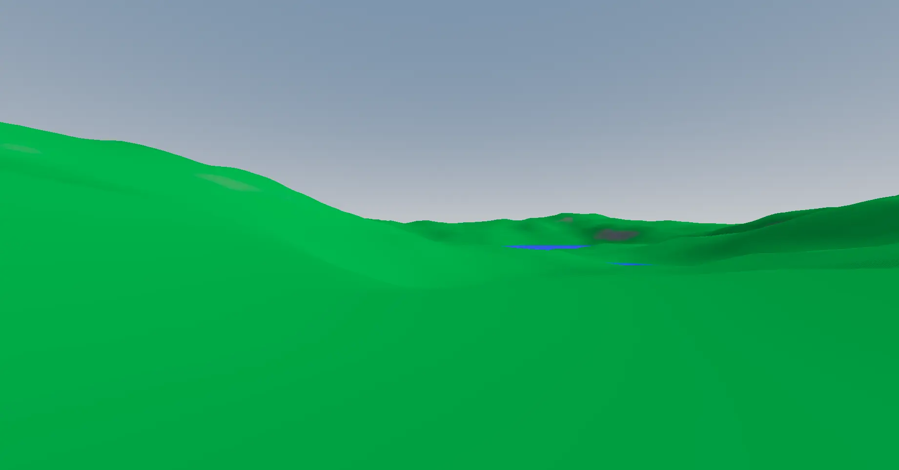
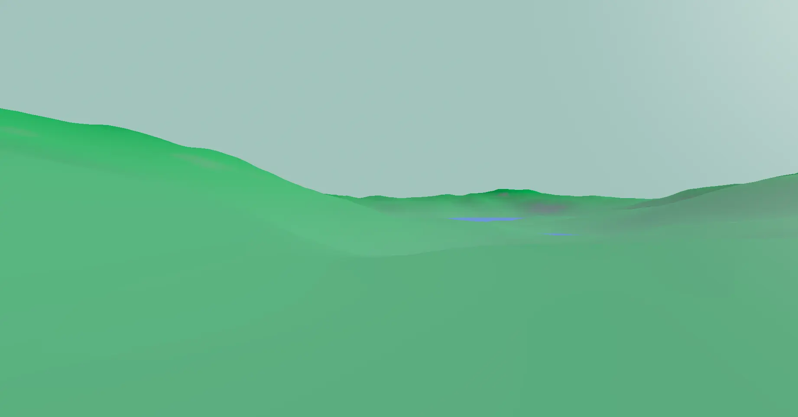
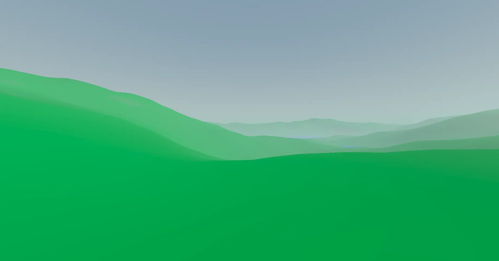

# Exponential Height Fog Demo

The implementation can be found on my Godot fork as a feature branch: https://github.com/zalan24/godot/tree/feature-exp-height-fog

## Running the Project

Since this project is a demo of a custom fork of Godot, you'll a dev environment for building Godot. Check [this guide](https://docs.godotengine.org/en/stable/contributing/development/compiling/index.html) on how to set it up.

```shell
$ git clone -b exp-height-fog --recurse-submodules https://github.com/zalan24/Godot-Demos.git
$ cd Godot-Demos/godot
$ scons target=editor
$ cd bin
$ ./godot.<build-variant>
```

From the Godot editor, open the `Godot-Demos/test-content`.

## What is Exponential Height Fog?

It's a simple type of fog, where the density is calculated based on world-y position. As we move up along the Y (up) axis, the fog exponentially gets lower. It resembles how the atmosphere's density decreases.

Simplified density model:
```math
simple\_fog\_density\left(pos\right) = e^{-pos_y}*base\_density
```

It is a very useful and simple tool, which can achieve really nice results at a very low performance cost.

Exp height fog can be applied to the sky naturally. It won't produce a visible contour between far terrain and the sky behind, but it will also leave the sky visible through the fog.

Exponential height fog is a great alternative to volumetric fog, in case the range or performance is important. It can be especially useful in case of large open world maps. It can render really nice fog at large distances at a very low performance cost.

In order achieve good performance, it has some limitations. It can't use the height-above-terrain, as that would lack a simple analytical solution to the fog density between the camera and a point in the world. Since no iteration or sampling is used, it also can't use shadows. It won't produce godrays.

## Current State

This feature is currently in prototype/demo state. It shows what results can be achieved, but the implementation is not final.

Features (existing):
* Analytical exp height fog calculations for correct fog density
* Applied to scenes
* Applied to skies
* Good performance (fog is calculated with a simple closed formula, no sampling/iterations required)

Missing:
* Clean up the code
* Measure performance & optimize

## Why This Change?

Godot does have a built in exp height fog already, but it works in a different way. The existing solution computes the strength of the fog on a given pixel based on the world-y position of that pixel. It's completely independent of the pixel's distance from the camera or the direction of the view ray. This solution looks surprisingly well when looked at from above, but falls apart as the camera enters the fog.

In a nutshell, the built-in solution uses the fog density at a pixel's world position directly as the fog strength applied to that pixel on the screen. My solution simply integrates the fog density along the ray between the camera and the pixel's world position to calculate the fog strength. This way, the fog gets stronger with distance.

The solution that I present here is very similar to how [Unreal Engine does it for example](https://dev.epicgames.com/documentation/en-us/unreal-engine/exponential-height-fog-user-guide?application_version=4.27).

## Math

Exponential height fog density:
$$fog\_density\left(p\right) = e^{-(p_y-base\_height)*h\_falloff}*base\_density$$

Where the world-space Y axis points upwards (the *.y* component is the height); *p* is a world-space position; The fog density is *base_density* at at any point at *base_height* on the Y axis; *h_falloff* is a multiplier on how quickly the density increases/decreases over the Y axis. *h_falloff* can be negative for inverse effect, and 0 for constant fog.

1 unit of *density* over a meter (unit distance) reduces transparency (percentage of light that gets through) to *1/e = exp(-1)*.

The distribution of density along the view ray is not important, only the total density (the integral) is.

```math
fog\_transparency(o, v, L) = exp(-\int_0^L fog\_density\left(o+v*t\right) \,dt) =
```
```math
exp(-\int_0^L e^{-(o_y+v_y*t-base\_height)*h\_falloff}*base\_density \,dt) =
```
```math
exp(-base\_density * \int_0^L e^{(base\_height-o_y-v_y*t)*h\_falloff} \,dt) =
```
```math
exp(-base\_density * (-\frac{e^{(base\_height-o_y-v_y*L)*h\_falloff}}{v_y*h\_falloff} + \frac{e^{(base\_height-o_y-v_y*0)*h\_falloff}}{v_y*h\_falloff})) =
```
```math
exp(-base\_density * (\frac{e^{(base\_height-o_y-v_y*0)*h\_falloff} - e^{(base\_height-o_y-v_y*L)*h\_falloff}}{v_y*h\_falloff})) =
```
```math
exp(-base\_density * (\frac{e^{(base\_height-o_y)*h\_falloff} - e^{(base\_height-o_y-v_y*L)*h\_falloff}}{v_y*h\_falloff}))
```

Where *o* is the the origin of the view ray; *v* is the view ray's normalized direction; and *L* is the view ray's length.

The above expression can be used if the *v.y\*h\_falloff* value is not zero. If it is, meaning that the view ray is horizontal or the h_falloff is 0, the fog density is constant along the given ray, so the simple exponential fog formula can be used:

```math
exp(-base\_density * \int_0^L const\_density \,dt) =
```
```math
exp(-base\_density * L * const\_density)
```

Where:
```math
const\_density = e^{-(o_y-base\_height)*h\_falloff}
```

### Sky

In case of the sky, the ray extends to infinity. The previous calculation do work as long if the fog exponentially decreases along the ray. Otherwise, the inner integral would be infinite &#8594; the the transparency as a whole converges to 0.

```math
fog\_transparency(o, v, \infty) = exp(-\int_0^\infty fog\_density\left(o+v*t\right) \,dt) =
```
```math
exp(-\int_0^\infty e^{-(o_y+v_y*t-base\_height)*h\_falloff}*base\_density \,dt) =
```
```math
exp(-base\_density * \int_0^\infty e^{(base\_height-o_y-v_y*t)*h\_falloff} \,dt) =
```
```math
exp(-base\_density * \frac{e^{(base\_height-o_y-v_y*0)*h\_falloff}}{v_y*h\_falloff}) =
```
```math
exp(-base\_density * \frac{e^{(base\_height-o_y)*h\_falloff}}{v_y*h\_falloff})
```

The above expression is valid if the *v_y\*h\_falloff > 0*, that is, the density decreases exponentially along the ray. Otherwise:

```math
fog\_transparency(o, v, \infty) = 0
```

## Screenshots

### From Above

#### No Fog

#### Original Fog

#### Proposed Implementation


#### Notes

The terrain close to the camera receives low amount of fog in both cases, so the difference is not apparent.

The fog's effect on the sky is very different. Both option use full sky effect, but the proposed implementation takes into account the exponential nature of the fog in these calculations. The sky does get hidden by it if the camera is deep inside the fog, but as the camera emerges, the sky becomes visible.

The proposed solution also looks more natural in this situation.

### From Below

#### No Fog

#### Original Fog

#### Proposed Implementation


#### Notes

This is the scenario that better shows the problems with the existing implementation.

The fog is exactly as strong on the terrain close to the camera as it is on the terrain far away. In fact, it doesn't matter how close we move the camera to the terrain, the fog remains the same.

Compare that to the proposed solution: fog is weak in the foreground and gets quite strong in the background.

The proposed solution also affects the sky more on this image, then in the previous one, because the camera is deeper in the fog.

## Parameters

The previous photos can be replicated by running this demo project with the default scene and using on of the two provided camera as *current* camera. Also apply the fog parameters from below.

Fog parameters for old fog:
```
fog_enabled = true
fog_light_color = Color(0.517647, 0.635294, 0.607843, 1)
fog_sun_scatter = 0.48
fog_density = 0.0
fog_height = 197.74
fog_height_density = 0.005
```

Fog parameters for the new fog:
```
fog_enabled = true
fog_light_color = Color(0.517647, 0.635294, 0.607843, 1)
fog_sun_scatter = 0.48
fog_density = 0.0
fog_height = 42.37
fog_height_density = 0.01
fog_height_falloff = 0.02
```

## Performance

|Testing equipment|                           |
|-----------------|---------------------------|
|OS               |Ubuntu 24.04 LTS           |
|GPU              |NVIDIA GeForce RTX™ 4060 Ti|
|CPU              |AMD Ryzen™ 9 7900X         |
|RAM              |32 GiB                     |
|Screen           |Full HD                    |
|Anti-Aliasing    |SSAA x2                    |

The performance was measured from the upper camera position (using the Camera3D node placed on the scene), in windowed mode, but maximized to full screen. VSync was turned off during the measurement.
I've used SSAA (x2) to make the pixel shaders slower in order to reduce noise in the measurements.

### Results

|        Configuration|              Result|                            Notes|
|---------------------|--------------------|---------------------------------|
|No fog:              |frame time = 2.824ms|reference value                  |
|Normal fog only:     |+33us               |                                 |
|Original height fog: |+40us               |                                 |
|New height fog:      |+49us               |**+9us** compared to the original|

