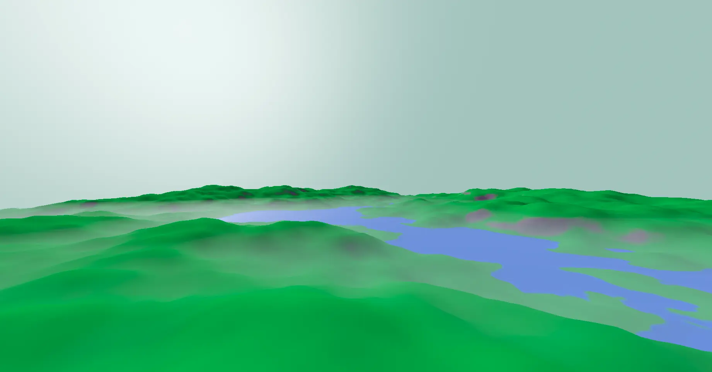
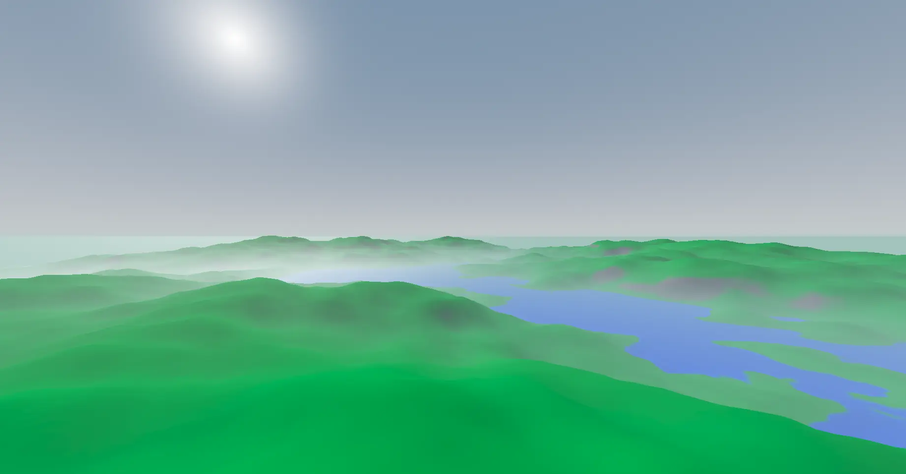

# Godot Demos

This repository features demos of my Godot contributions. A demo for each contribution is published as a separate branch inside this repository, referencing my [forked Godot repository](https://github.com/zalan24/godot/) as a submodule.

## Features & Changes

### Exponential height fog

The existing implementation of the exponential height fog in Godot is not correct. It skips computing an important integral (of density over distance). As a result, the "grayness" of each pixel is computed based on the world Y position of the pixel, ignoring the distance from the camera all together.

This change fixes that while maintaining good performance.

Demo: https://github.com/zalan24/Godot-Demos/tree/exp-height-fog

Implementation: https://github.com/zalan24/godot/tree/feature-exp-height-fog

| Before                                                                               | After                                                                                |
|--------------------------------------------------------------------------------------|--------------------------------------------------------------------------------------|
|||